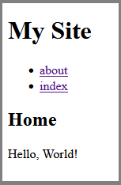

# Minimal SSG

A minimal static site generator.




## Installation

You must have [git](https://git-scm.com/) and [Node.js](https://nodejs.org/en)
installed.

Clone the repository.

```sh
git clone https://github.com/travishorn/minimal-ssg
```

Change into the package's directory.

```sh
cd minimal-ssg
```

Install the dependencies.

```sh
npm install
```

## Configuration

Modify `config.yaml` to set the...

- `siteTitle` which appears in the browser tab and at the top of each page.
- `language` which sets the [`lang` global
  attribute](https://developer.mozilla.org/en-US/docs/Web/HTML/Global_attributes/lang).
- `inputDir` where your markdown files are located.
- `outputDir` where the built files will be written.

## Authoring Content

Write all your content in markdown files the `./content` directory.

## Building

Generate static HTML from your markdown.

```sh
npm run generate
```

Built HTML files are output to the `./public` directory.

## Deploying

Copy the built HTML files to your hosting provider.

## Further Customization

You can modify `template.html` to further customize the template each page uses.

You can also modify `index.js` for ultimate customization. It is the actual site
generator script. It's pretty simple (less than 50 lines of code).

## License

The MIT License

Copyright 2024 Travis Horn

Permission is hereby granted, free of charge, to any person obtaining a copy of
this software and associated documentation files (the “Software”), to deal in
the Software without restriction, including without limitation the rights to
use, copy, modify, merge, publish, distribute, sublicense, and/or sell copies of
the Software, and to permit persons to whom the Software is furnished to do so,
subject to the following conditions:

The above copyright notice and this permission notice shall be included in all
copies or substantial portions of the Software.

THE SOFTWARE IS PROVIDED “AS IS”, WITHOUT WARRANTY OF ANY KIND, EXPRESS OR
IMPLIED, INCLUDING BUT NOT LIMITED TO THE WARRANTIES OF MERCHANTABILITY, FITNESS
FOR A PARTICULAR PURPOSE AND NONINFRINGEMENT. IN NO EVENT SHALL THE AUTHORS OR
COPYRIGHT HOLDERS BE LIABLE FOR ANY CLAIM, DAMAGES OR OTHER LIABILITY, WHETHER
IN AN ACTION OF CONTRACT, TORT OR OTHERWISE, ARISING FROM, OUT OF OR IN
CONNECTION WITH THE SOFTWARE OR THE USE OR OTHER DEALINGS IN THE SOFTWARE.
